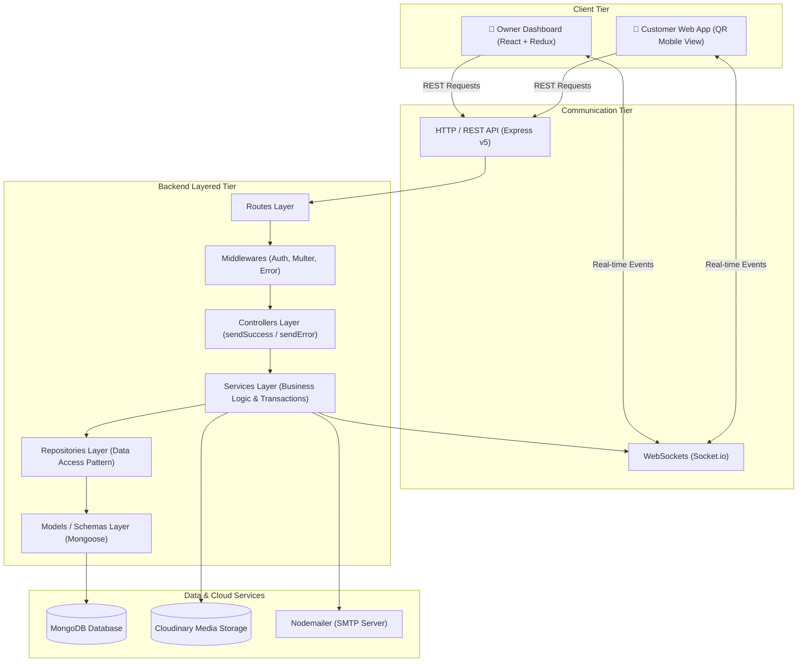
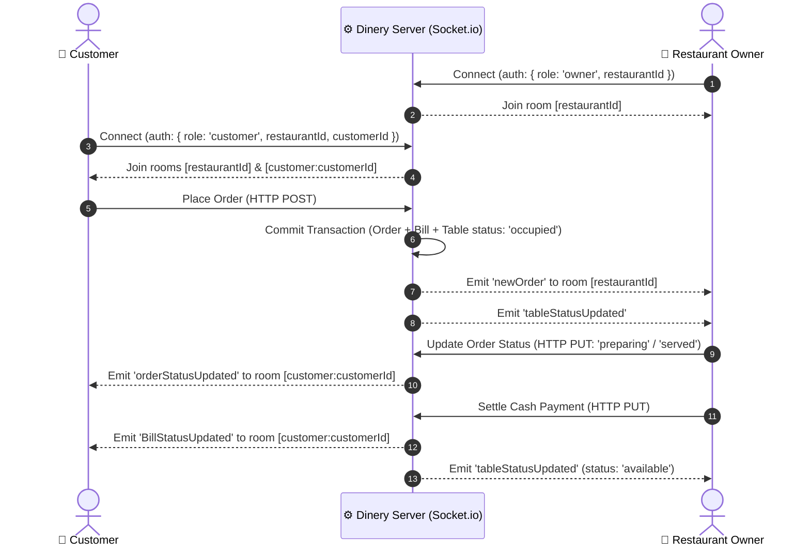

# 🍽️ DINERY — Smart Restaurant Management & QR Dining Platform

DINERY is a modern, full-stack, real-time restaurant management and contactless QR dining solution. It empowers restaurant owners to manage orders, tables, live kitchen status, menus, analytics, and billing seamlessly, while giving customers an intuitive, app-less dining experience directly via dynamic table QR codes.

---

## 📑 Table of Contents

- [✨ Key Features](#-key-features)
  - [👑 Restaurant Owner / Admin Suite](#-restaurant-owner--admin-suite)
  - [📱 Customer QR Dining Experience](#-customer-qr-dining-experience)
- [🛠️ Tech Stack](#️-tech-stack)
- [🏗️ System & Layered Architecture](#️-system--layered-architecture)
  - [High-Level Architecture](#high-level-architecture)
  - [Backend Layered Architecture](#backend-layered-architecture)
  - [Real-Time WebSocket Architecture](#real-time-websocket-architecture)
- [📂 Project Folder Structure](#-project-folder-structure)
  - [Overview](#overview)
  - [Backend Directory Structure](#backend-directory-structure)
  - [Frontend Directory Structure](#frontend-directory-structure)
- [🔌 Complete API Documentation](#-complete-api-documentation)
  - [Authentication & Restaurant Endpoints](#1-authentication--restaurant-api)
  - [Category Management Endpoints](#2-category-management-api)
  - [Food Menu Management Endpoints](#3-food-menu-management-api)
  - [Table & QR Code Endpoints](#4-table--qr-code-api)
  - [Customer Dining Endpoints](#5-customer-dining-api)
  - [Order Management Endpoints](#6-order-management-api)
  - [Billing & Settlement Endpoints](#7-billing--settlement-api)
  - [Analytics Endpoints](#8-analytics-api)
  - [Report Generation Endpoints](#9-report-generation-api)
  - [Restaurant Settings Endpoints](#10-restaurant-settings-api)
- [⚡ Real-Time Socket.io Events](#-real-time-socketio-events)
- [🗄️ Database Schemas](#️-database-schemas)
- [🚀 Getting Started & Setup Guide](#-getting-started--setup-guide)
  - [Prerequisites](#prerequisites)
  - [Backend Setup](#1-backend-setup)
  - [Frontend Setup](#2-frontend-setup)
- [🔒 Security Best Practices](#-security-best-practices)
- [📄 License](#-license)

---

## ✨ Key Features

### 👑 Restaurant Owner / Admin Suite
- **Secure Authentication & OTP Verification:** Registration with email verification using Nodemailer OTP, JWT-based HTTP-only cookie sessions, and bcrypt password encryption.
- **Live Interactive Dashboard:** Real-time summary cards for daily orders, active tables, revenue, and last 7-day order trend visualization.
- **Live Order & Kitchen Management (KDS):** Instant real-time order notifications via WebSockets; multi-stage order workflow (`pending` ➔ `preparing` ➔ `served` ➔ `completed` / `cancelled`).
- **Dynamic Table & QR Code System:** Create tables with seating capacities; automatically generate downloadable, scannable dynamic QR codes tied to unique UUIDs. Real-time table states: `available`, `active`, `occupied`.
- **Menu & Category Catalog:** Categorized food menu management with image uploads to Cloudinary; instant toggle for item availability (in-stock / out-of-stock).
- **Billing & Cash Payment Settlement:** Automatic 5% GST tax calculation and bill generation; single-click cash settlement that clears bills and resets table availability.
- **Business Analytics & Visualizations:** Visual breakdown of sales trends, daily/weekly/monthly revenue, order counts, and top 10 best-selling items via interactive Recharts.
- **Exportable PDF Reports:** Customer transaction reports, daily sales breakdowns, annual GST tax collection reports, and monthly revenue summaries with automatic PDF downloads via jsPDF.
- **Profile & Account Settings:** Custom restaurant branding (profile image, restaurant name, address), owner contact details, GST number management, and password updates.
- **Subscription / Premium Tier Support:** Infrastructure for Free and Premium tier features.

### 📱 Customer QR Dining Experience
- **Contactless Table Access:** Scan table QR code to automatically open the digital restaurant menu.
- **Seamless Table Check-in:** Simple name and mobile verification with concurrency protection preventing duplicate table claims.
- **Interactive Digital Menu:** Browse item categories, view high-resolution food images, pricing, and live stock status.
- **Real-Time Cart & Order Placement:** Build cart, customize item quantities, and place orders directly to the restaurant kitchen.
- **Live Order Status Tracking:** Automatic live updates when the kitchen accepts and prepares the food without page refreshes.
- **Digital Bill Preview:** View itemized subtotal, taxes, and final bill amount in real time.
- **Smart Availability Protection:** Automatic notification if restaurant services or owner connections are unavailable.

---

## 🛠️ Tech Stack

### Frontend
| Category | Technology | Description |
|---|---|---|
| **Core Framework** | React 19 (`react`, `react-dom`) | Modern component-based declarative UI |
| **Build Tool** | Vite 7 (`@vitejs/plugin-react`) | High-speed bundling and development server |
| **State Management** | Redux Toolkit (`@reduxjs/toolkit`, `react-redux`) | Predictable centralized state with async thunks |
| **Routing** | React Router v7 (`react-router-dom`) | Client-side routing with nested layouts and protection |
| **Styling** | Tailwind CSS v4 (`@tailwindcss/vite`) | Modern utility-first responsive styling |
| **Animations** | Framer Motion | Fluid UI transitions and splash screen animations |
| **Data Visualization**| Recharts | Composable charting library for business analytics |
| **PDF Generation** | jsPDF & jsPDF-AutoTable | Client-side PDF generation for financial reports |
| **Real-time Client** | Socket.io Client (`socket.io-client`) | Bidirectional WebSocket communication with backend |
| **Icons & Alerts** | Lucide React, React Icons, React Toastify | Modern icons and actionable notification toasts |

### Backend
| Category | Technology | Description |
|---|---|---|
| **Runtime & Server** | Node.js, Express.js 5 (`express`) | Fast, unopinionated REST API server |
| **Database & ODM** | MongoDB, Mongoose 9 (`mongoose`) | Schematized NoSQL database with ACID transactions |
| **Real-Time Engine** | Socket.io (`socket.io`) | WebSocket server handling room-based event broadcasting |
| **Authentication** | JSON Web Tokens (`jsonwebtoken`), `bcrypt` | Secure authentication and password hashing |
| **File Storage** | Cloudinary (`cloudinary`, `multer-storage-cloudinary`, `multer`) | Cloud-based media storage and multipart file handling |
| **Email & Verification** | Nodemailer (`nodemailer`) | SMTP email dispatch for OTP verification |
| **QR Code Engine** | QRCode (`qrcode`) | Dynamic QR code generation for restaurant tables |
| **Security & Utilities**| `cookie-parser`, `cors`, `dotenv`, `validator`, `morgan` | Request parsing, CORS policies, logging, and validations |

---

## 🏗️ System & Layered Architecture

### High-Level Architecture



### Backend Layered Architecture

The backend follows an industry-standard **4-Tier Layered Architecture with the Repository Pattern** ensuring modularity, clear separation of concerns, and maintainability:

1. **Routing Layer (`/routes`):** Declares endpoint URL paths, HTTP methods, and associates middleware handlers (JWT authentication, Multer uploads).
2. **Controller Layer (`/controllers`):** Receives HTTP requests, validates parameters and request payloads, delegates business operations to services, and formats standard responses via `sendSuccess` and `sendError`.
3. **Service Layer (`/services`):** Encapsulates core business rules, multi-step MongoDB transactions (`session`), email dispatch, and WebSocket notification broadcasts.
4. **Repository Layer (`/repositories`):** Abstracts data access logic, database queries, and MongoDB aggregation pipelines away from the business layer.
5. **Data Access / Model Layer (`/models`):** Defines strict Mongoose schemas, indexes, and document models.
6. **Middlewares (`/middlewares`):** Centralizes JWT authentication (`authenticateResturant`), Multer-Cloudinary image streaming, and global unhandled error catching.
7. **Socket Layer (`/socket`):** Handles bidirectional real-time WebSocket state, room routing (`restaurantId` and `customer:{customerId}`), and event emission.
8. **Utilities (`/utils`):** Centralized response helpers (`sendSuccess`, `sendError`), password encryption, QR code generators, and OTP utilities.

### Standardized Response Structure

All API endpoints return a standardized, uniform JSON response:

#### Success Response
```json
{
  "success": true,
  "statusCode": 200,
  "message": "Operation completed successfully",
  "data": { ... }
}
```

#### Error Response
```json
{
  "success": false,
  "statusCode": 400,
  "message": "Validation or operation error description",
  "error": "Detailed error message"
}
```

### Real-Time WebSocket Architecture



---

## 📂 Project Folder Structure

### Overview
```
dinery/
├── backend/                # Node.js & Express.js REST API + Socket.io Server
├── frontend/               # React 19 + Vite + Redux Toolkit Client
└── README.md               # Project documentation
```

---

### Backend Directory Structure

```
backend/
├── config/
│   ├── cloudConfig.js             # Cloudinary configuration and Multer storage
│   └── mongoDB-connection.js      # MongoDB Mongoose database connection
├── controllers/                   # Request handling and standardized responses
│   ├── analyticsController.js     # Analytics endpoint controllers
│   ├── billController.js          # Bill calculation & settlement controllers
│   ├── categoryController.js      # Menu category management
│   ├── customerController.js      # Customer login, dashboard & ordering
│   ├── foodController.js          # Food item CRUD & availability controllers
│   ├── orderController.js         # Order tracking & status update controllers
│   ├── otpController.js           # Email OTP request & verification
│   ├── reportController.js        # Business & tax report controllers
│   ├── restaurantController.js    # Restaurant auth & dashboard data
│   ├── settingController.js       # Profile, GST & password update controllers
│   └── tableController.js         # Table management & QR code assignment
├── middlewares/
│   ├── authMiddleware.js          # JWT verification & restaurant resolver
│   ├── errorMiddleware.js         # Global error handling middleware (sendError)
│   └── multerMiddleware.js        # File upload parser middleware
├── models/                        # Mongoose schemas & data models
│   ├── bill-model.js              # Bill schema (amounts, tax, payment status)
│   ├── categories-model.js        # Category schema (name, Cloudinary image)
│   ├── customer-model.js          # Customer session schema
│   ├── food-model.js              # Food product schema (price, image, status)
│   ├── order-model.js             # Order schema (items, subtotal, status)
│   ├── otp-model.js               # Time-expiring OTP schema
│   ├── restaurant-model.js        # Restaurant profile & credentials schema
│   ├── subscription-model.js      # Premium subscription schema
│   └── table-model.js             # Table schema (tableId, QR UUID, status)
├── repositories/                  # Data access layer (encapsulating queries)
│   ├── billRepository.js          # Bill queries & aggregation pipelines
│   ├── categoryRepository.js      # Category CRUD queries
│   ├── customerRepository.js      # Customer session queries
│   ├── foodRepository.js          # Food item CRUD & toggle queries
│   ├── orderRepository.js         # Order queries & sales aggregation pipelines
│   ├── otpRepository.js           # OTP verification queries
│   ├── restaurantRepository.js    # Restaurant profile & credential queries
│   ├── subscriptionRepository.js  # Subscription plan queries
│   └── tableRepository.js         # Table queries & status mutations
├── routes/                        # Express API route declarations
│   ├── analyticsRoutes.js         # /api/analytics
│   ├── billRoutes.js              # /api/bill
│   ├── categoryRoutes.js          # /api/category
│   ├── customerRoutes.js          # /api/customer
│   ├── foodRoutes.js              # /api/food
│   ├── orderRoutes.js             # /api/order
│   ├── reportRouter.js            # /api/report
│   ├── restaurantRoutes.js        # /api/restaurant
│   ├── settingRoutes.js           # /api/setting
│   └── tableRoutes.js             # /api/tables
├── services/                      # Core business logic & database transactions
│   ├── analyticsService.js        # Order, revenue & top items service
│   ├── billService.js             # Bill transactions & payment settlement service
│   ├── categoryService.js         # Category CRUD & cascading food cleanup
│   ├── customerService.js         # Customer session & table allocation service
│   ├── emailValidationService.js  # Email format & domain validator
│   ├── foodService.js             # Food queries & image deletion service
│   ├── orderService.js            # Order placement transactions & status transitions
│   ├── otpService.js              # OTP generation & validation service
│   ├── reportService.js           # Daily sales, GST & customer report service
│   ├── restaurantService.js       # Restaurant authentication & dashboard service
│   ├── settingService.js          # Profile & password modification service
│   └── tableService.js            # Table status mutations & QR code builder
├── socket/
│   ├── socketEvent.js             # Outbound real-time socket event broadcasters
│   └── socketServer.js            # Socket.io server initialization & room routing
├── utils/
│   ├── deletImg.js                # Cloudinary image removal helper
│   ├── generateOTP.js             # Random numeric OTP generator
│   ├── generateQR.js              # QR code generator creating data URLs
│   ├── hashPassword.js            # Bcrypt hashing & password comparison helpers
│   ├── responseHandler.js         # Standardized sendSuccess and sendError helpers
│   └── sendOtpToEmail.js          # Nodemailer email transport handler
├── .env                           # Environment configuration
├── app.js                         # Application entrypoint & HTTP server bootstrap
├── package.json                   # Backend dependencies & scripts
└── vercel.json                    # Serverless deployment configuration
```

---

### Frontend Directory Structure

```
frontend/
├── public/                        # Static public assets
├── src/
│   ├── assets/                    # Images, logos, and vector assets
│   ├── components/
│   │   ├── owner/                 # Owner-specific UI (Navbar, ProfileCard)
│   │   ├── public/                # Landing page components (Hero, Stats, Footer)
│   │   └── ui/                    # Reusable UI widgets (Spinners, Skeletons, Modals)
│   ├── features/                  # Feature-driven modular state & logic
│   │   ├── analytics/             # Analytics charts, hooks, service & Redux slice
│   │   ├── auth/                  # Login/Register forms, OTP verification slice & thunks
│   │   ├── bill/                  # Bill display, payment handler hooks & slice
│   │   ├── customer/              # Customer menu browsing, cart & ordering slice
│   │   ├── dashboard/             # Owner dashboard metrics & summary widgets
│   │   ├── loadside/              # Initial dashboard loader & state hydration
│   │   ├── manu/                  # Food menu & category management slice/modals
│   │   ├── order/                 # Order list, status update hooks & slice
│   │   ├── premium/               # Subscription upgrade UI & logic
│   │   ├── reports/               # Report filters, tables & PDF export generators
│   │   ├── settings/              # Profile, GST & password settings forms
│   │   └── table/                 # Table grid, QR modal & status controllers
│   ├── hooks/                     # Custom React hooks (useSocket, useAuth)
│   ├── layouts/                   # Layout wrappers (OwnerLayout, CustomerLayout)
│   ├── pages/
│   │   ├── auth/                  # Login and Register pages
│   │   ├── customer/              # CustomerHome, CustomerOrder, CustomerBill, InvalidSession
│   │   ├── owner/                 # OwnerDashboard, OwnerMenu, OwnerTables, OwnerOrders,
│   │   │                          # OwnerAnalytics, OwnerReports, RestaurantSettings, UpgradePremium
│   │   └── public/                # Home and About landing pages
│   ├── routes/
│   │   ├── AppRoutes.jsx          # Root application routing
│   │   ├── CustomerRoutes.jsx     # Customer protected flow & socket sync
│   │   └── OwnerRoutes.jsx        # Owner authenticated routes & splash loader
│   ├── store/                     # Central Redux store configuration
│   ├── App.jsx                    # Root App component with Toast container
│   ├── main.jsx                   # React DOM render entry point
│   └── index.css                  # Global styles & Tailwind CSS imports
├── .env                           # Frontend environment variables
├── index.html                     # HTML5 template
├── package.json                   # Frontend dependencies & scripts
├── vite.config.js                 # Vite build configuration
└── vercel.json                    # Frontend deployment routing configuration
```

---

## 🔌 Complete API Documentation

### Base URL
- **Local API URL:** `http://localhost:3000/api`

---

### 1. Authentication & Restaurant API
Base Route: `/api/restaurant`

| Method | Endpoint | Auth | Description | Request Body / Params |
|---|---|---|---|---|
| `POST` | `/otp` | Public | Send 6-digit OTP to owner email for registration | `{ "ownerEmail": "string", "restaurantName": "string" }` |
| `POST` | `/verifyOTP` | Public | Verify sent OTP code | `{ "ownerEmail": "string", "otp": "string" }` |
| `POST` | `/registerRestaurant` | Public | Register a new restaurant and issue auth cookie | `{ "restaurantName": "string", "address": "string", "ownerName": "string", "password": "string", "ownerPhone": "string", "ownerEmail": "string" }` |
| `POST` | `/login` | Public | Authenticate owner and set HTTP-only JWT cookie | `{ "ownerEmail": "string", "password": "string" }` |
| `GET` | `/dashboard` | 🔒 Owner | Fetch complete restaurant state (profile, foods, categories, tables, today's orders, bills, 7-day trends) | *None* |

---

### 2. Category Management API
Base Route: `/api/category`

| Method | Endpoint | Auth | Description | Request Body / Params |
|---|---|---|---|---|
| `POST` | `/addcategory` | 🔒 Owner | Add a new food category (Multipart/form-data) | Form fields: `name`, File: `image` |
| `PUT` | `/editcategory/:categoryId` | 🔒 Owner | Update category name or replace image | URL Param: `categoryId`<br>Form fields: `name` (optional), File: `image` (optional) |
| `DELETE` | `/deletcategory/:categoryId` | 🔒 Owner | Delete category and all associated food items | URL Param: `categoryId` |

---

### 3. Food Menu Management API
Base Route: `/api/food`

| Method | Endpoint | Auth | Description | Request Body / Params |
|---|---|---|---|---|
| `POST` | `/create` | 🔒 Owner | Create a new food item (Multipart/form-data) | Form fields: `name`, `description`, `price`, `category`<br>File: `image` |
| `PUT` | `/updatefood/:foodId` | 🔒 Owner | Edit food item details or image | URL Param: `foodId`<br>Form fields: `name`, `description`, `price`, `category`, `isAvailable`<br>File: `image` (optional) |
| `PUT` | `/changeavailablity/:foodId` | 🔒 Owner | Toggle food availability (`isAvailable: true/false`) | URL Param: `foodId` |
| `DELETE` | `/deletfood/:foodId` | 🔒 Owner | Delete food item and remove its Cloudinary image | URL Param: `foodId` |

---

### 4. Table & QR Code API
Base Route: `/api/tables`

| Method | Endpoint | Auth | Description | Request Body / Params |
|---|---|---|---|---|
| `GET` | `/getalltable` | 🔒 Owner | Fetch all tables with populated QR code image data & active customer details | *None* |
| `POST` | `/createtable` | 🔒 Owner | Create table with seat capacity and generate QR code | `{ "tableNumber": "number", "capacity": "number" }` |
| `GET` | `/getTable/:tableId` | 🔒 Owner | Fetch single table details with active order/customer | URL Param: `tableId` |
| `PUT` | `/updatetablestatus/:tableId` | 🔒 Owner | Update table status (`available`, `active`, `occupied`) | URL Param: `tableId`<br>Body: `{ "status": "string", "customer": "string" }` |
| `DELETE` | `/deletetable/:tableId` | 🔒 Owner | Delete table (only allowed when status is `available`) | URL Param: `tableId` |

---

### 5. Customer Dining API
Base Route: `/api/customer`

| Method | Endpoint | Auth | Description | Request Body / Params |
|---|---|---|---|---|
| `POST` | `/:restaurantName/login` | Public (QR Token) | Customer check-in at a table using table QR UUID token | URL Param: `restaurantName`<br>Body: `{ "name": "string", "phone": "string", "token": "string" }` |
| `GET` | `/:restaurantName/loadCustomerDashbord` | Customer Token | Load customer view (menu, cart, active order, bill) | URL Param: `restaurantName`<br>Header: `Authorization: Bearer <token>` or Cookie |
| `POST` | `/:restaurantName/placeOrder` | Customer Token | Submit order, generate bill, and mark table `occupied` | URL Param: `restaurantName`<br>Body: `{ "orders": { "items": [{ "food": "id", "name": "string", "price": 0, "quantity": 0, "subtotal": 0 }] }, "customer": { "_id": "id" } }` |

---

### 6. Order Management API
Base Route: `/api/order`

| Method | Endpoint | Auth | Description | Request Body / Params |
|---|---|---|---|---|
| `GET` | `/:orderId` | 🔒 Owner | Fetch single order populated with table and customer data | URL Param: `orderId` |
| `PUT` | `/:orderId/status` | 🔒 Owner | Update status (`pending`, `preparing`, `served`, `completed`, `cancelled`) | URL Param: `orderId`<br>Body: `{ "status": "string" }` |

---

### 7. Billing & Settlement API
Base Route: `/api/bill`

| Method | Endpoint | Auth | Description | Request Body / Params |
|---|---|---|---|---|
| `GET` | `/:billId` | 🔒 Owner | Get bill details by bill ID | URL Param: `billId` |
| `PUT` | `/cashPayment/:tableId/:billId` | 🔒 Owner | Settle bill with cash payment, update payment status to `paid`, and reset table status to `available` | URL Params: `tableId`, `billId`<br>Body: `{ "customerId": "string" }` |

---

### 8. Analytics API
Base Route: `/api/analytics`

| Method | Endpoint | Auth | Description | Query Parameters |
|---|---|---|---|---|
| `GET` | `/orders` | 🔒 Owner | Fetch order volume analytics aggregated by time unit | `type` (`week`, `month`, `year`), `year`, `month`, `week` |
| `GET` | `/revenue` | 🔒 Owner | Fetch revenue analytics aggregated across paid bills | `type` (`week`, `month`, `year`), `year`, `month`, `week` |
| `GET` | `/top-items` | 🔒 Owner | Fetch top 10 best-selling items by quantity sold | `type` (`week`, `month`, `year`), `year`, `month`, `week` |

---

### 9. Report Generation API
Base Route: `/api/report`

| Method | Endpoint | Auth | Description | Request Body / Params |
|---|---|---|---|---|
| `GET` | `/customer-report` | 🔒 Owner | Get last 7 days customer transactions (name, order ID, bill price) | *None* |
| `GET` | `/dailySale-report` | 🔒 Owner | Get last 7 days daily sale aggregation (date, total orders, total revenue) | *None* |
| `GET` | `/GST-report` | 🔒 Owner | Get current year GST tax collection aggregated by month | *None* |
| `GET` | `/monthlyRevenue-report` | 🔒 Owner | Get current year monthly revenue aggregation | *None* |

---

### 10. Restaurant Settings API
Base Route: `/api/setting`

| Method | Endpoint | Auth | Description | Request Body / Params |
|---|---|---|---|---|
| `PATCH` | `/RestaurantProfileUpdate` | 🔒 Owner | Update restaurant name, address, and profile logo (Multipart) | Form fields: `restaurantName`, `address`<br>File: `image` |
| `PATCH` | `/OwnerInformationUpdate` | 🔒 Owner | Update owner personal information | `{ "ownerName": "string", "ownerPhone": "string", "ownerEmail": "string" }` |
| `PATCH` | `/GSTNumberUpdate` | 🔒 Owner | Update restaurant GST tax identification number | `{ "gstNumber": "string" }` |
| `PATCH` | `/PasswordUpdate` | 🔒 Owner | Change owner account password | `{ "CurrentPassword": "string", "NewPassword": "string" }` |

---

## ⚡ Real-Time Socket.io Events

### Connection Handshake
Clients connect to Socket.io with credentials passed in `socket.handshake.auth`:
```javascript
// Owner Connection
socket = io("http://localhost:3000", {
  auth: {
    role: "owner",
    restaurantId: "<RESTAURANT_ID>"
  }
});

// Customer Connection
socket = io("http://localhost:3000", {
  auth: {
    role: "customer",
    restaurantId: "<RESTAURANT_ID>",
    customerId: "<CUSTOMER_ID>"
  }
});
```

### Event Reference
| Event Name | Target / Room | Direction | Payload | Description |
|---|---|---|---|---|
| `newOrder` | `restaurantId` (Owner room) | Server ➔ Owner | `{ orderId, billId, tableId }` | Triggered when customer places an order |
| `tableStatusUpdated` | `restaurantId` (Owner room) | Server ➔ Owner | `tableId` | Triggered on table check-in, order, or cash clearance |
| `orderStatusUpdated` | `customer:<customerId>` | Server ➔ Customer | `{ orderId, status }` | Triggered when owner advances order state |
| `BillStatusUpdated` | `customer:<customerId>` | Server ➔ Customer | `{ billId, status }` | Triggered when cash payment is settled |
| `serviceUnavailable` | Customer Socket | Server ➔ Customer | *None* | Emitted if customer connects while owner is offline |

---

## 🗄️ Database Schemas

- **Restaurant:** `restaurantName` (unique), `ownerName`, `ownerEmail`, `ownerPhone`, `password` (hashed), `address`, `profileImg`, `publicId`, `gstNumber`, `plan` (`free`/`premium`), `isPremium`, `createdAt`.
- **Table:** `restaurant` (ref), `tableId` (Number), `tableNumber` (String), `capacity`, `qrCode` (UUID token), `status` (`available`/`active`/`occupied`), `currentCustomer` (ref), `activeSince`.
- **Category:** `restaurant` (ref), `name`, `image` (Cloudinary URL), `publicId`.
- **Product / Food:** `restaurant` (ref), `name`, `description`, `price`, `foodImg`, `publicId`, `category` (ref), `isAvailable`.
- **Customer:** `restaurant` (ref), `name`, `phone`, `table` (ref), `createdAt`.
- **Order:** `restaurant` (ref), `customer` (ref), `table` (ref), `items` (`[{ food, name, price, quantity, subtotal }]`), `totalAmount`, `status` (`pending`/`preparing`/`served`/`completed`/`cancelled`), `createdAt`.
- **Bill:** `restaurant` (ref), `order` (ref), `billAmount`, `tax` (5%), `finalAmount`, `paymentStatus` (`paid`/`unpaid`), `paymentMode` (`cash`/`upi`/`card`), `paymentAt`, `createdAt`.
- **OTP:** `email`, `otp` (Number), `expiresAt` (TTL index), `verified` (Boolean).
- **Subscription:** `restaurant` (ref), `plan` (`free`/`premium`), `price`, `startDate`, `endDate`, `isActive`.

---

## 🚀 Getting Started & Setup Guide

### Prerequisites
- [Node.js](https://nodejs.org/) (v18 or higher)
- [MongoDB](https://www.mongodb.com/) (Local or MongoDB Atlas cluster)
- [Cloudinary](https://cloudinary.com/) account (for image hosting)
- SMTP Gmail credentials / App Password (for OTP emails)

---

### 1. Backend Setup

1. **Navigate to the backend directory:**
   ```bash
   cd backend
   ```

2. **Install dependencies:**
   ```bash
   npm install
   ```

3. **Create an `.env` file in `backend/`:**
   ```env
   EXPRESS_PORT=3000
   NODE_ENV=development
   MONGODB_URL=mongodb+srv://<username>:<password>@cluster.mongodb.net/dinery?retryWrites=true&w=majority
   JWT_SECRET_KEY=your_super_secret_jwt_key
   FRONTEND_URL=http://localhost:5173

   # Cloudinary Credentials
   CLOUD_NAME=your_cloudinary_cloud_name
   CLOUD_API_KEY=your_cloudinary_api_key
   CLOUD_API_SECRET=your_cloudinary_api_secret

   # Nodemailer SMTP Email
   EMAIL=your_email@gmail.com
   MYPASS=your_google_app_password
   ```

4. **Start the backend server:**
   ```bash
   node app.js
   ```
   *The server + socket.io will run at `http://localhost:3000`.*

---

### 2. Frontend Setup

1. **Navigate to the frontend directory:**
   ```bash
   cd ../frontend
   ```

2. **Install dependencies:**
   ```bash
   npm install
   ```

3. **Create an `.env` file in `frontend/`:**
   ```env
   VITE_BASE_URL=http://localhost:3000/api
   VITE_SOCKET_URL=http://localhost:3000
   ```

4. **Start the Vite development server:**
   ```bash
   npm run dev
   ```
   *The frontend will run at `http://localhost:5173`.*

---

## 🔒 Security Best Practices
- Passwords are securely hashed with salted `bcrypt`.
- Authentication tokens are preserved in secure `httpOnly` cookies to protect against XSS attacks.
- Atomic MongoDB multi-document transactions ensure data consistency during order placement and bill settlement.
- Cloudinary asset cleanup triggers automatically upon category or food item deletion.
- Real-time socket connections enforce strict authorization checks based on user roles and active sessions.

---

## 📄 License
This project is licensed under the **ISC License**.
